# DNSTEST

## 综述

* DNSTEST主要功能：

1. DNS功能回归测试;
2. DNS协议合规性测试(genreport);

## 回归测试工具

### 原理


### 编译(可跳过)
不需要编译，直接使用二进制即可。
```bash
# 1. go 版本需要在1.13以上。
# 2. 编译
#   2.1 windows
    go build -mod=vendor -o dnstest.windows
#   2.2 linux
    go build -mod=vendor -o dnstest.linux
```

### 安装
```bash
# windows
  ln -sf dnstest.windows dnstest 
# linux
  ln -sf dnstest.linux dnstest 
```

### 配置

### testcase.csv

| 列数  | 字段        | 类型     | 说明                                                         |
| ----- | ----------- | -------- | ------------------------------------------------------------ |
| 第1列 | CaseName    | string   | 用例名称，唯一标识一个用例                                   |
| 第2列 | Domain      | string   | 请求域名                                                     |
| 第3列 | Qtypes      | []string | 请求类型(逗号分隔),目前支持A,AAAA,CNAME,NS,MX,PTR,CAA,SRV,TXT,SOA,ANY |
| 第4列 | Clientip    | string   | edns携带的客户端ip地址，支持ipv4/ipv6，支持加掩码            |
| 第5列 | Rcode       | string   | 期望响应码，目前支持NOERROR;FORMERR;SERVFAIL;NXDOMAIN;NOTIMPL;REFUSED;YXDOMAIN;YXRRSET;NXRRSET;NOTAUTH;NOTZONE;BADSIG;BADKEY;BADTIME;BADMODE;BADNAME;BADALG;BADTRUNC;BADCOOKIE |
| 第6列 | Answer+Authority | []string | 期望answer字段的响应结果，可配置多项(逗号分隔)；格式参考rfc1035; <domain> [<ttl>] [<class>] <type> <rrdata> |
| 第7列 | MatchMethod | string   | PartMatch:1<=匹配的个数<=期望的个数 并且 匹配的个数 = 响应的个数 则返回正确; AllMatch:全部匹配返回正确；具体数字：表示应返回的响应的个数(默认：-1，表示不指定)；这个参数主要针对A记录会配置权重，只返回部分结果的情况； |
| 第8列 | EDNSBufSize | uint16   | 默认：空，当clientip存在时，表示默认值4096；当clientip不存在时，表示不携带edns选项 |

### 使用

批量发送测试用例
```bash
# 指定测试服务IP：
vim etc/config.json
# 修改测试用例：
vim etc/testcase.csv
# 测试：
# ./dnstest
```

也可以像dig一样发单次dns, 参数支持qname/qtype/server/subnet
例如：
```bash
# ./dnstest -once @10.226.146.245 www.qq.com CNAME
# ./dnstest -once -p 53102 @10.226.133.100 www.qq.com +subnet=1.1.1.1
```

## 合规测试工具

### 安装

```bash
# git clone git@github.com:zhaotao19860/dnstest.git
# cd dnstest/DNS-Compliance-Testing-master/ && chmod a+x genreport
# 如果需要重新编译：
# autoreconf -fvi && ./configure && make && make install
```

### 使用

```bash
# cd $GOPATH/src/github.com/zhaotao19860/dnstest/DNS-Compliance-Testing-master
# echo ednstest.top | ./genreport -fB -r 2.2.3.69(测试环境由于不能出公网，需要修改测试域名的ns，指向测试的授权服务器地址)
```
      

